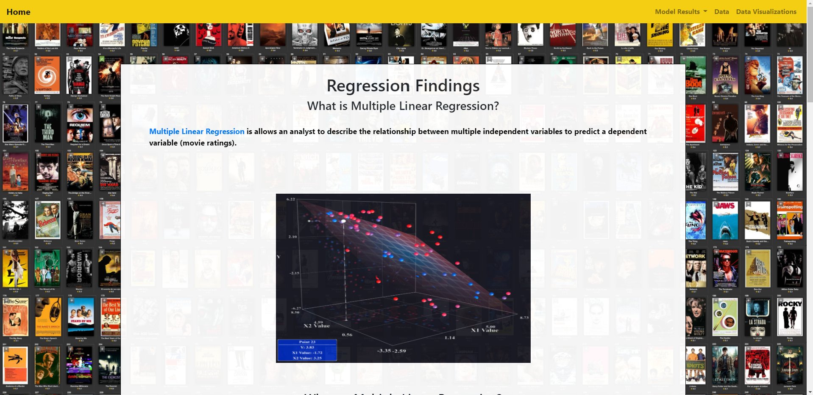
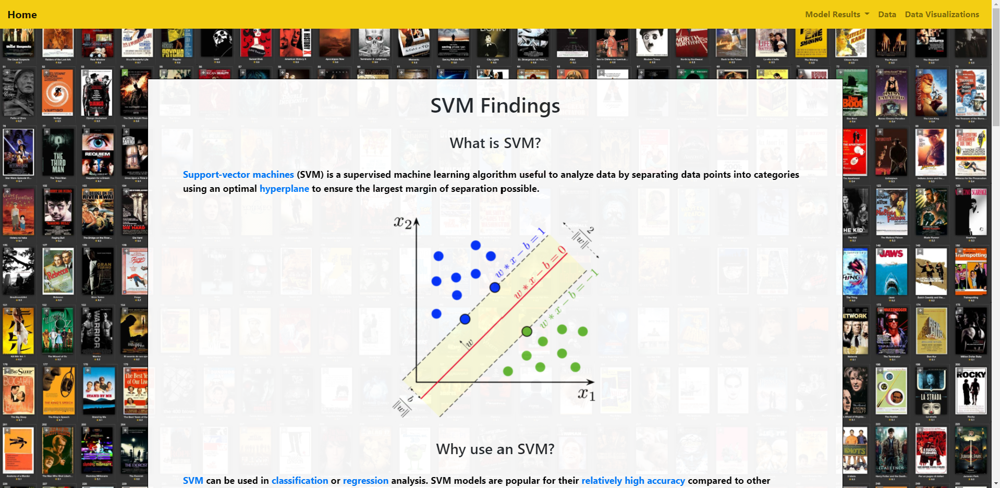
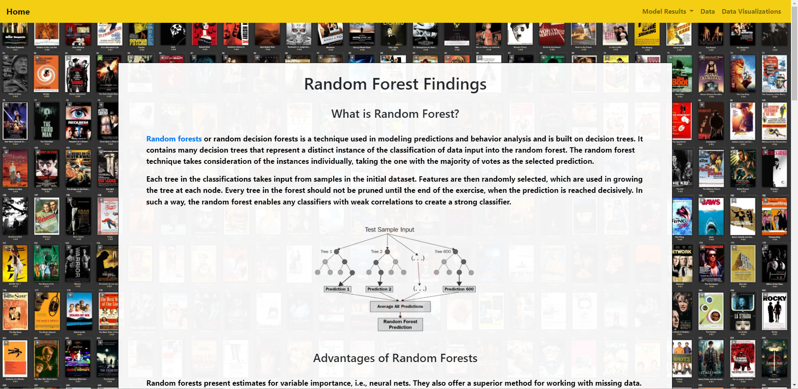
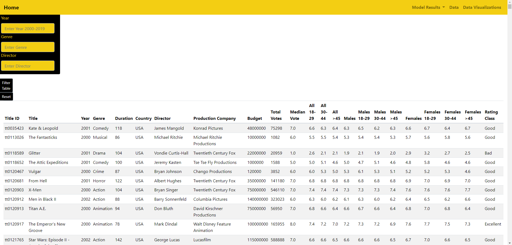
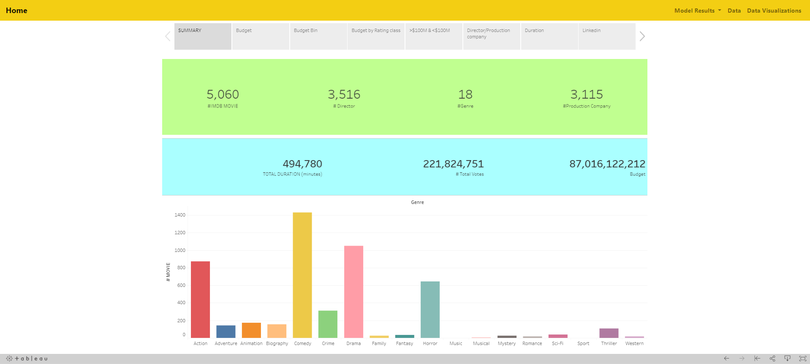
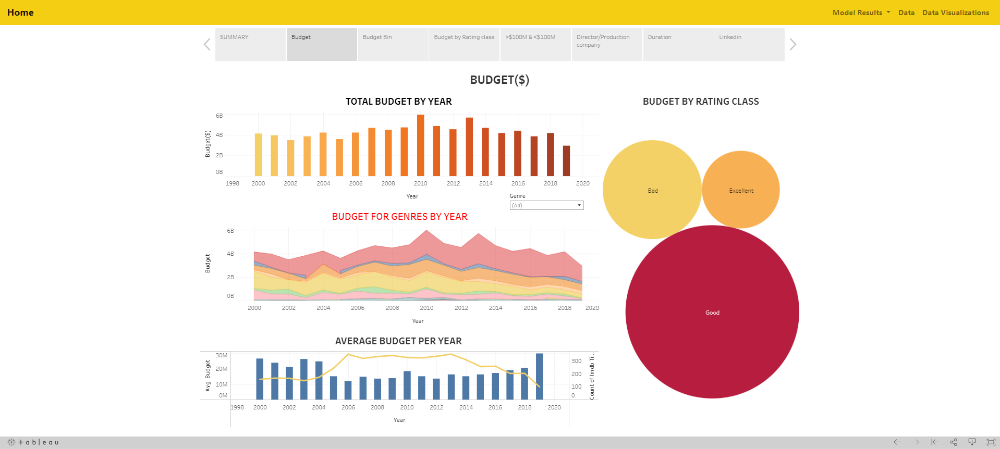
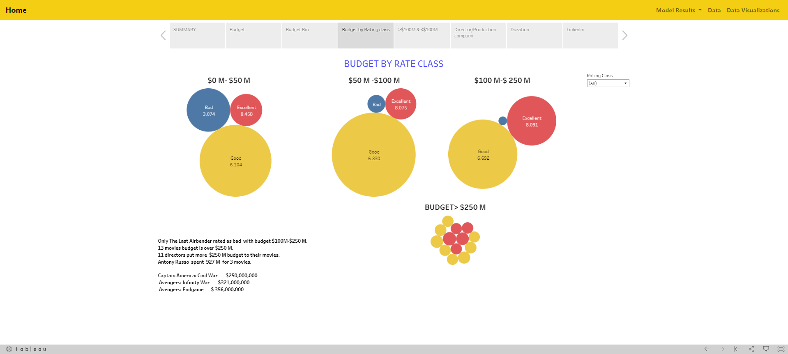
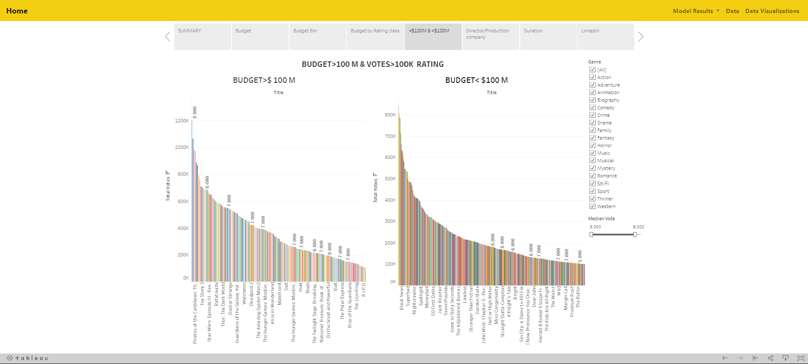
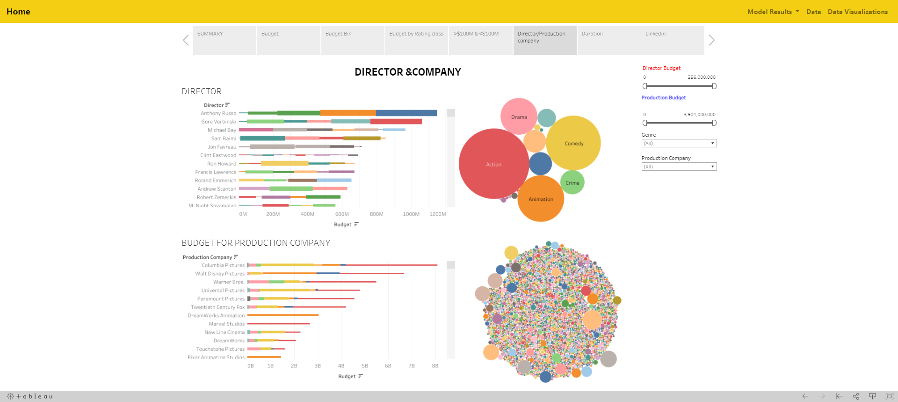
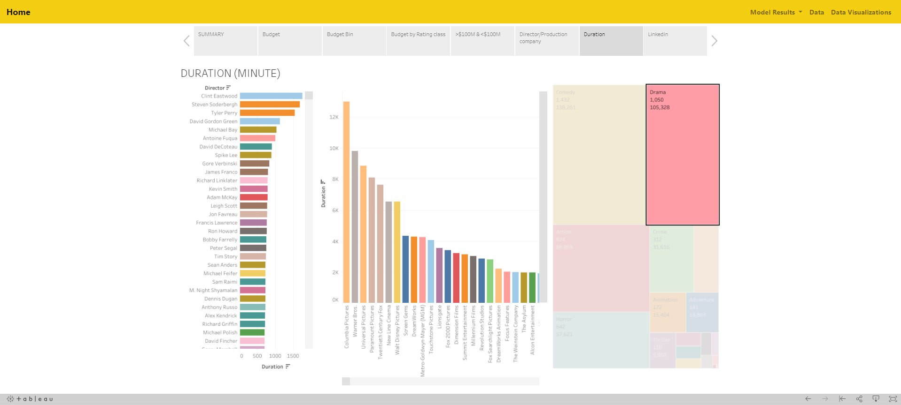

# IMDB-Machnine-Learning: Final Project for 2021 University of Minnesota Data Analytics Bootcamp

Final Project for 2010 University of Minnesota  Data Analytics Bootcamp IMDb Machine Learning by Jon, Mallory, Habibe and Jag. This project is focused on designing models to predict IMDB movie ratings based on genre, year of release, budget, duration, and director.

https://jagnoor.github.io/IMDB-Machnine-Learning/ 

## Method and Detail

 We sourced our data from [Kaggle.com](https://www.kaggle.com/stefanoleone992/imdb-extensive-dataset/) which featured a set of CSV files with information regarding movies rated by IMDB users dating back from 1906 to 2019.

Link to Dataset: https://www.kaggle.com/stefanoleone992/imdb-extensive-dataset/

### Methods Used
* Data Cleaning using python in a jupyter notebook 
* Data Visualization using Tableau
* Machine learning models using python and jupyter notebooks: multiple linear regression, deep learning, random forest, and support-vector machines.

## ETL
``movie_cleaning.ipynb`` was used to complete ETL on ``IMDB_movies.csv`` and ``IMDB_ratings.csv`` to generate ``imdb_final.csv``. This final CSV is the basis for the data used in machine learning. These files are saved in [Resources](Resources).

Run [movie_cleaning.ipynb](movie_cleaning.ipynb)

## Data Visualization
Tableau was used to explore and visualize the data. 

## Machine Learning

### Preprocessing and scaling
The data from ``imdb_final.csv`` needed to be preprocessed. First, the categorical columns genre and director were dummy encoded using pandas. Then, that data was reformmated using using label encoder from sklearn.preprocessing,scaled using standard scaler from sklearn.preprocessing, and then to categorical using tensorflow.keras.utils.

### [Multiple Linear Regression](https://jagnoor.github.io/IMDB-Machnine-Learning/pages/Regression)
Multiple linear regression is not a feasible model for this data. It was attempted in the file: [multiple_linear_regression.ipynb](multiple_linear_regression.ipynb)

### Deep Learning
Deep learning is a model that can predict the rating of a movie. It was completed in: [deep_learning.ipynb](deep_learning.ipynb)

### Random Forest
Random forest is a model that can predict the rating of a movie. It was completed in: [rf_model.ipynb](rf_model.ipynb)

### [Support-vector machines (SVMs)](https://jagnoor.github.io/IMDB-Machnine-Learning/pages/svm)
Support-vector machines is a model that can predict the rating of a movie. It was completed in: [svm_model.ipynb](svm_model.ipynb)

[View the results](https://jagnoor.github.io/IMDB-Machnine-Learning/)

## Website Preview

#

#

#

#

#

#

#

#

#

#

#

#

#

